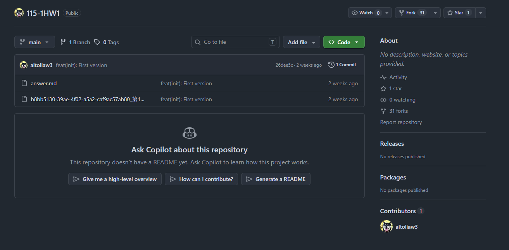
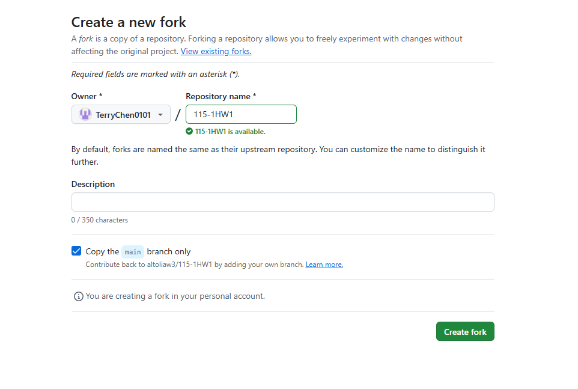
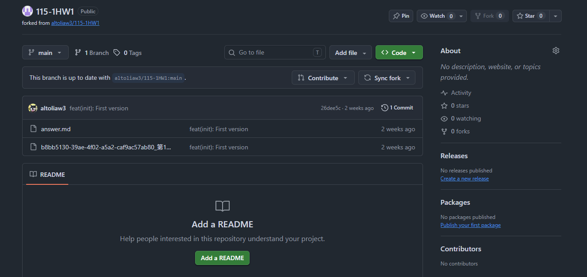
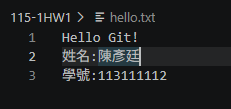
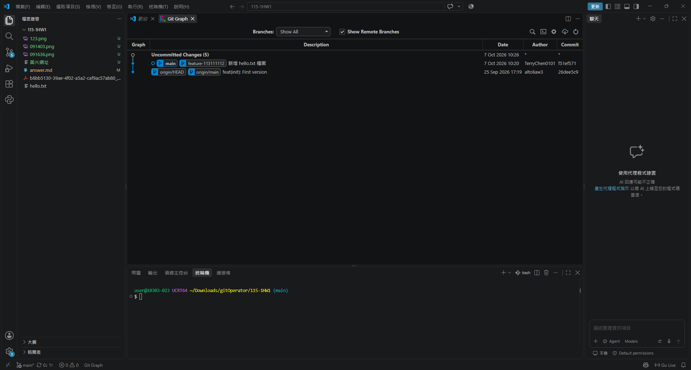

# 第1次作業題目-隨堂-HW1
>
>學號：113111112
><br />
>姓名：陳彥廷
><br />
>作業撰寫時間：180mins
><br />
>最後撰寫文件日期：2026/10/07
>

本份文件包含以下主題：(至少需下面兩項，若是有多者可以自行新增)
- [x] 說明內容
- [x] 其他 (可以包含心得或是想跟老師反映)

## 說明內容

開始寫說明，該說明需說明想法，
並於之後再對上述想法的每一部分將程式進一步進行展現，
若需引用程式區則使用下面方法，
若為.cs檔內程式除了於敘述中需註明檔案名稱外，
還需使用語法` ```語言種類 程式碼 ``` `，其中語言種類若是要用python則使用py，java則使用java，C/C++則使用cpp，
下段程式碼為語言種類選擇csharp使用後結果：

```csharp
public void mt_getResult(){
    ...
}
```

若要於內文中標示部分網頁檔，則使用以下標籤` ```html 程式碼 ``` `，
下段程式碼則為使用後結果：

```html
<%@ Page Language="C#" AutoEventWireup="true" ...>

<!DOCTYPE html>

<html xmlns="http://www.w3.org/1999/xhtml">
<head runat="server">
<meta http-equiv="Content-Type" ...>
    <title></title>
</head>
<body>
    <form id="form1" runat="server">
        <div>
        </div>
    </form>
</body>
</html>
```
更多markdown方法可參閱[https://ithelp.ithome.com.tw/articles/10203758](https://ithelp.ithome.com.tw/articles/10203758)

請在撰寫"說明程式與內容"該塊內容，請把原該塊內上述敘述刪除，該塊上述內容只是用來指引該怎麼撰寫內容。

1. 請參閱Topic 0的 git clone 該頁(P. 12)中，看完fork內容後，請完成老師倉庫的
fork，截圖並說明如何完成。

Ans:
先到老師的倉庫，點右上角的fork

會進入以下畫面，直接按創建新的fork

如果變成以下畫面，就代表新建成功，成功把專案新增到自己的倉庫


2.請研究markdown基本寫作方法，並請對常見語法進行介紹後，請給個例子。 

Ans:
**1.標題字**
*# 的數量決定了標題的層級大小，最多支援到6層
# H1大標題，通常用於文章主標題
## H2標題，主要用於章節、大段落標題
### H3標題
#### H4標題
##### H5標題
###### H6標題，這是字體最小

**2.程式碼**
*前後三個反引號 *``` *+ 語言，以下為舉例 <br>
```markdown
print("Hello")
```

**3.字體樣式** <br>
**文字** 為粗體 <br>
*文字* 為斜體 <br>
***文字*** 為粗體+斜體 <br>
~~文字~~ 為刪除縣 <br>

3.請在你的專案中完成下面的操作，最後把結果推上 GitHub，並截圖 git graph 說
明你的做法。步驟如下： 

Ans:
**步驟i 建立新分支** <br>
從 main 分支建立一條新分支，名稱為"feature-113111112"，並切換到這條新分支。<br>
(`git checkout -b feature-113111112`)
**步驟ii 在新分支上新增檔案並寫入內容** <br>
在新分支上新增檔案hello.txt，內容為"Hello Git!"、"姓名"、"學號" <br>
(`hello.txt`)->(`Hello Git!、姓名:陳彥廷、學號:113111112`) <br>
 <br>
**步驟iii 提交（commit）**<br>
把新增的檔案加入暫存區，再進行commit，commit 訊息要能說明這次「新增 hello.txt」。 <br>
(`git add hello.txt`、`git commit -m "新增 hello.txt 檔案"`、) <br>
**步驟iv合併** <br>
切回main分支，把剛剛的新分支合併進main。 <br>
(`git checkout main`、git merge feature-113111112) <br>
最後結果為圖下 <br>
 

4. 請於「點我」找到自己的名字後，並於對應的「github帳號位址 [請撰寫]」欄位
中，貼上網址，其網址規則要貼的內容為：

Ans:連結填好了<br>


## 其他
這次的作業，讓我更熟悉git的指令，以及markdown的用法，坦白說一開始挺不熟悉的，有時候不知道該用哪個指令，像是"git clone"，原本太了解他的用途，後面了解它是用來克隆的，將遠端的Git倉庫，完整複製下載到我的本機電腦中，挺方便的，不用像以前一樣把資料從雲端硬碟或隨身碟拿出；markdown之前比較少用，但偶爾在Discord也用的到，因為DC有些也是markdown語法，markdown學起來也是能好好運用。